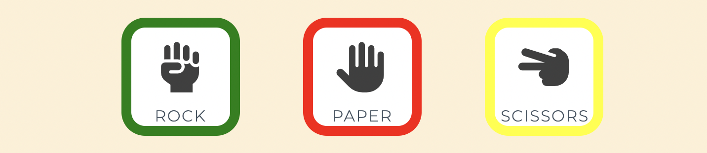
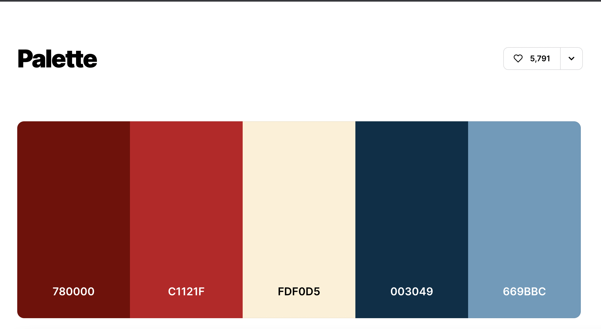
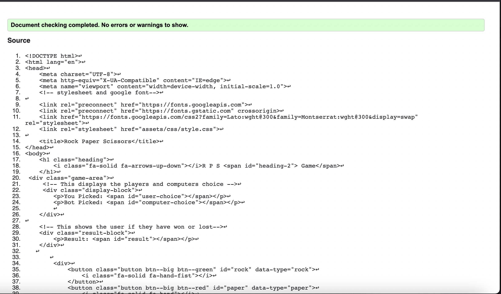
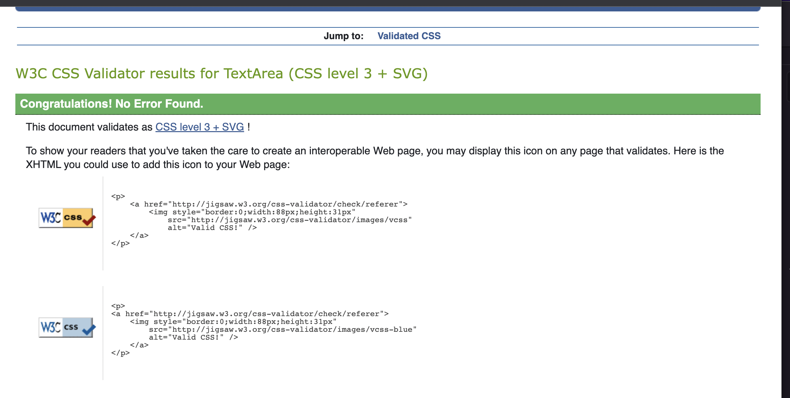
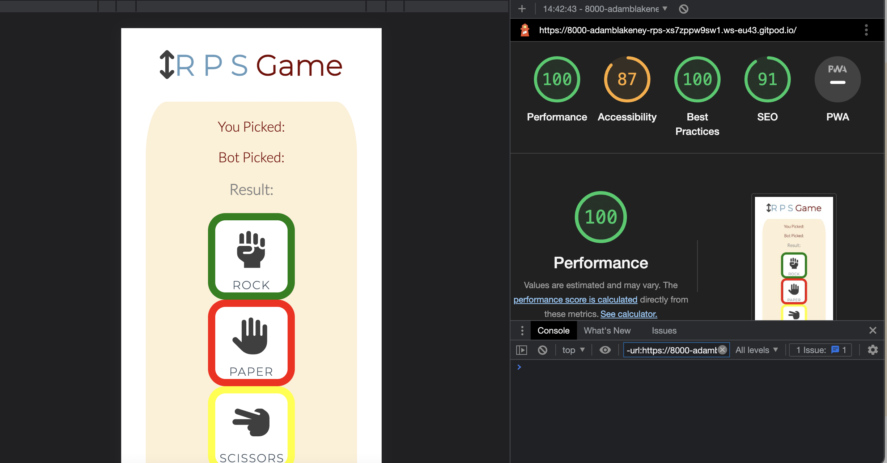
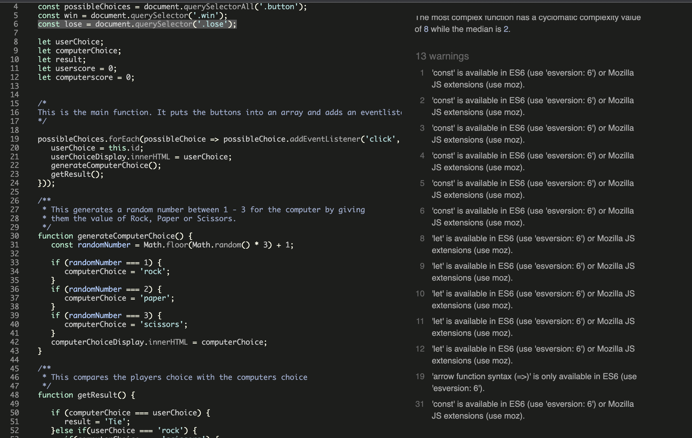

<h1>R P S Game</h1>

The project has been undertaken to create a game that is one interactive and uses javascript to react to user inputs and work across all devices.

Visit RPS game [here](https://adam-blakeney.github.io/R-P-S/).

The aims of this site is to give the user a good ux experience with seamless interactive game play with simple easy to use design.

# Table of Contents:
- [**UX**](#ux)
  * [User aims](#user-aims)
  * [Strategy](#strategy)
  * [Structure](#structure)
- [**Features**](#features)
  * [1. Heading](#1-heading)
  * [2. Icons](#2-icons)
  * [3. Display Area](#3-display-area)
- [**Technologies used**](#technologies-used)
  * [Websites](#websites)
- [**Testing**](#testing)
  * [Code Validators](#code-validators)
  * [Manual Testing](#manual-testing)
  * [Bugs and Fixes](#bugs-and-fixes)
  * [Improvements](#improvements)
- [**Deployment**](#deployment)
  * [Github Deployment:](#github-deployment)
- [**Credits**](#credits)
  * [Content](#content)
  * [Media](#media)
  * [Acknowledgements](#acknowledgements)

# **UX**
## 1. User aims
Here I have a list I created of things  that I would look for/ expcet in a website as a user.

As a user, I would like to quickly and effectively understand the purpose and information of the site.
As a user, I need to be able to easily navigate the website.
As a user, I want the buttons to be responsive so I know they are working.
As a user, I would like to understand the rules of the game without having the need for instructions.
As a new user,  I want to enjoy the game and be challanged by the games difficulty.
As a user, I would like to use the site on mobile and desktop.

Returning Users

As a returning user, I would like to be able to quickly understand the website and the game.

As a returning user, I need to be able to still find the game enjoyable and challanging.

## 2. Strategy
Project goals

The aim of this project is to build a game with a core focus on java script that is not only fun and entertaining but also functional and intuitive.
I achieved this with the use of set color schemes adn keeping the sith aesthetic and ergonomic.

## 3. Structure

The structure of the website is based around a single page design. This is to keep the game as simple to play and straight forward as possible. So new users and returning users, will be able to play without needed to try figure out the website/game.

# **Features**

## 1. Heading
Placed at the top of the page is the games heading R P S all in capital letters making it easy to see and read for the user.

## 2. Icons
The icons are an integral part of my site. from the header to the buttons. the are there to give clear understanding for the user as to what the site and buttons contain. This along with alt text can help the visually impaired.

## 3. Display Area
This are holds all the information thats relevant to the user input and computer output.
You Picked:
Bot Picked:
Result:
is placed above the buttons as this is the game area. this requires the focus of the user.
Games Won: 0
Games Lost: 0
is placed below the buttons as this is the score keeping section so it seperated from the gaming secition .

## 4. Refresh Button
Underneath the Score Area is the refresh button.
The button will refresh the page therfore starting the game again for the user, this creates a level of convince for the user.
The button will change to a different shade when the users cursor hovers over it.

# **Technologies used**
## Websites

In the creation of this website there were multiple websites I used. Below is a list to credit them and their use in my site.
__coolers__
(https://coolors.co/palette/780000-c1121f-fdf0d5-003049-669bbc)
I used this site to chose my color pallete that would be the basis for my visual theme in the site. 
This is the link to the color pallete I used.

__Slack__
(https://slack.com/intl/en-ie/)
Slack used to see how issues from other students were solved and to help with my own issues and to find work arounds

__Stackoverflow__
(https://stackoverflow.com/)

Stackoverflow was used to help me with more specific ideas and to help me with coming up and learning new ideas. 

__Google fonts__
(https://fonts.google.com/)

Google fonts was used to find my fonts that i would iuse for my site which were , Montserrat and Lato.

__Font awesome__
(https://fontawesome.com/)

Font awesome was used for the icons present in my site. 

# **Testing**

## Code validators 
I used 2 code validators for my site one for the html and one for the css.

 __HTML__
 (https://validator.w3.org/#validate_by_input)
 

 __CSS__
 (https://jigsaw.w3.org/css-validator/#validate_by_input)
 

 __Lighthouse__
 The Lighthouse developer tool was also used.

__JS__
(https://jshint.com/)

I used these sites to continually assess my code during my project to clear any code errors early. 
I did a final check of my code at the end. being left with no errors and only a caution on Jshint i am confident my code is in a good place and all bugs have been aleviated.

## Manual testing

The maual testing i done was mainly carried ut by using the command {python3 -m http.server}.
this gave me a preview of the website and the code ive just added. So this would show me if the code has actually worked whether or not if the code is written correcly or not. 

This also was a big help with CSS and sizing as i could see what colours work and pictures but also see if the content is being laid out in the way I want.

Using the inspect function was a second way for me to text the website. I would use this to see how the page would be displayed with diffrent screen sizes.
Using this I was able to adapt my code for every single device.
i also sent to friends and family in order to get them to use the site and report and bugs or imporvements.

## Bugs and Fixes

during this project I ran in to countless bugs issues and things I would have to just take a different approch with as I couldnt get it how I wanted.

Here i will explaian one briefly.

i intially struggled getting all the JS in the corect order and coded correctly. this led me to an issue with the gameOver function. i could not get it to carry out but discovered i have left the function name out of the event listener earlier in code. something so small led to huge delays in my project. i attempted using stack over flow and slack and even student help but in the end playing with it eventually gave me the answer.

## Improvements

There are three things I identified during my project and on review that I was unable to do, for lack of knowledge that I would have liked to incorporate. I hope to learn how to do this to be able to incorporate in future projects.

i would like to add more feautures. such as adding more options(ie. Lizard , Spock)

i would like to add more interactivity. such as playing noises for buttons, screen flashing for wins and losses.

i would like to chnage the look of the alert to a more aesthetically pleasing one.

# **Deployment**
## Github deployment

The project is deployed to GitHub Pages. To deploy the site follow the instruction below.

1. In GitHub navigate to the MS1 RedBog Renewables Repository.
2. Locate 'Settings', navigate to 'Source' and select Master Branch from the dropdown and click Save.
3. Refresh page
4. The site will be published and confirmation shown on the page.

